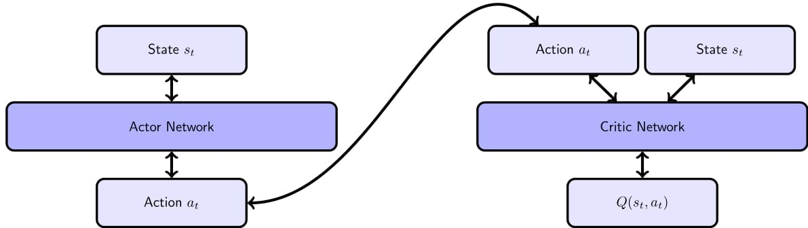

**This is a work in progress project.**

## Overview:
Recent publications from DeepMind like (Mnih et al., 2013) and (Lillicrap et al., 2015) in the fields of deep reinforcement learning opened a new field for robot locomotion. Reinforcement learning is a form of machine learning by trial & error. The Robot can evaluate the quality of a state and is trying to advance in order to maximize its reward. By applying deep neural networks we try to generate more complex robot locomotion. 
 

## The quadrupedal robot
In order to research in the field of model free gait generation we created a quadrupedal robot. By using deep neural networks we try to generate stable walking gaits and even more complex moving tasks.  

  
The robot has three degrees of freedom per leg and is also completely simulable in V-REP.
After simulation we try to transfer the learned behavior to the real robot that is shown in the picture above.

## A robot learns to walk 
The aim of this project is to teach an agent how to walk and even to localize itself in relation to an arbitrary aim.
As you can see in the following video the trained agent always tries to follow the red dot.
<iframe width="560" height="315" src="https://www.youtube.com/embed/SIs9NMIHulU" frameborder="0" allowfullscreen></iframe>

The agents learns by using the deep deterministic policy gradient approach by (Lillicrap et al., 2015).
Our approach is called DDPG-Gait and consists of two neural networks.
The first neural network (the actor) generates the 12 continuous servo positions directly. It gets judged from the second neural network (the critic), that evaluates the state and actions taken by trying to maximize its reward. 

### The model 

As you can see in the picture above the model is based on two neural networks.
1. The Critic-Network consists of two hiddenlayer with Sigmoid activation.  
2. The Actor-Network consists of two hiddenlayers with relu activation. For the Output-layer a tanh-function is used in order to map the output the servo angles. 
We used latin hypercube sampling to obtain the Hyperparameters for our model. 
To obtain these and to train the neural networks a single Titan X (pascal) was used. 
The following pseudocode shows the DDPG Algorithm by (Lillicrap et al., 2015).  
  
The critic is trained by minimizing the bellman equation in line 11. But in contrast to Deep-Q-Learning it only outpus one Q-value per state-action pair. The actor on the other hand can be trained by directly applying the gradient in line 14. 
The equation was derived by (Silver et al., 2014). 

However enviornment, actions, state and reward need to be defined:

1. The **Environment** is given by the Simulator. 
2. The most straigh forward approach is to define the **actions** by a twelve dimensional vector   

Where theta defines the servo angle at time t.
3. **State** the state can be defined as action taken in t-1. However in order to localize the agent relative to the red ball we added angle and distance relative to an arbitrary aim. 
4. In order to get a **Reward** we defined the moved distance from time t-1 to t. 

### Results
The picture below shows the robot gait pattern.  

The gait diagram below visualizes this pattern. Every dot in the following picture marks the time when the specific leg is lifted 

As you can see it follows a natural trot gait by always lifting the diagonally opposite leg. 

The next video shows the results for the real robot.
<iframe width="560" height="315" src="https://www.youtube.com/embed/ZHgOhR1QOPs" frameborder="0" allowfullscreen></iframe>

# Acknowledgement
We gratefully acknowledge the support of NVIDIA Corporation with the donation of the Titan X Pascal GPU used for this research.
# References:

[(Mnih et al., 2013), Playing Atari with Deep Reinforcement Learning](https://arxiv.org/abs/1312.5602)

[(Silver et al. 2014), Deterministic Policy Gradient](http://www0.cs.ucl.ac.uk/staff/D.Silver/web/Applications_files/deterministic-policy-gradients.pdf) 

[(Lillicrap et al., 2015), Continuous control with deep reinforcement learning](https://arxiv.org/abs/1509.02971) 
